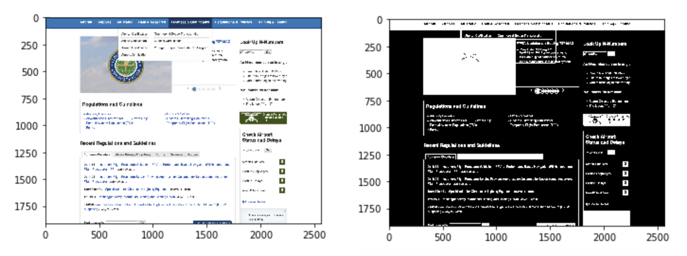
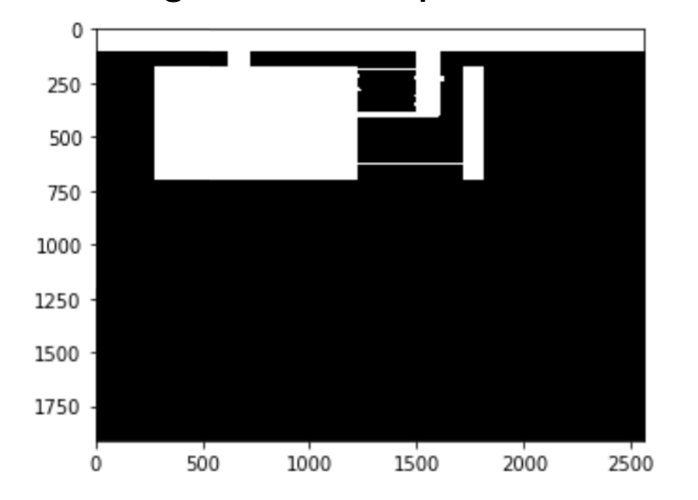
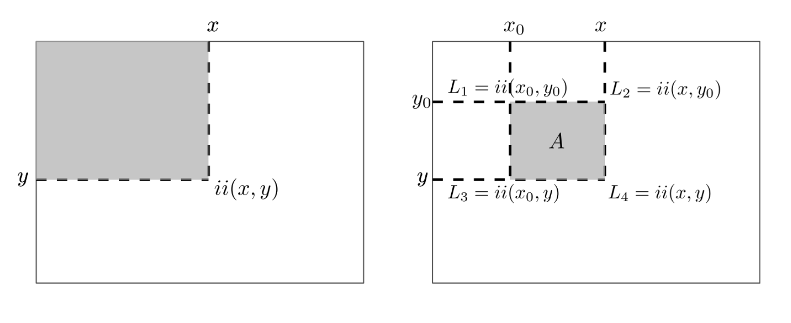

# JSCleaner:  Analysis of different versions of index

## 1. Structural Comparison

### i) Screenshots of the entire page.

For taking screenshots of the entire page, Selenium was used. First the selenium driver was run and the page was scrolled to the bottom, a wait was added for the page to load and the height was noted and stored. Then, a headless driver was run with the stored height and constant width (1920px).

    options.add_argument("--headless")
    options.add_argument("--window-size=1920,{height}")
    options.add_argument("--hide-scrollbars")

After this the screenshots were saved using the built in selenium function:

    driver.save_screenshot(Path)

### ii) Similarity Scores

For the comparison, two methods were used: sklearn's SSIM index and the mean squared error. Mean squared error is defined as the sum of the squared difference between the two images as shown below.

    def mse(imageA, imageB):
        err = np.sum((imageA.astype("float") - imageB.astype("float")) ** 2)
        err /= float(imageA.shape[0] * imageA.shape[1])
        return err

For both of these to work, the images must have the same dimensions since both of these scores are based on pixel by pixel calculations.

## Functional Comparison

### a. Screenshots.

For the first step, all the Classes and IDs were extracted. To do this, the source code from Selenium was passed through a parser based on beautifulsoup

    soup = bs(driver.page_source.encode("utf-8"),"lxml")

After this, functions from beautifulsoup were used to extract all the Classes and IDs using `tag.get('id')`

Using this all the tags and their corresponding IDs/Classes were stored in a list.

Now selenium was used to loop over the list and to (a) scroll to the part of the page where the tag with a particular ID/class in the list exists, (b) hover over the tag, and (c) take a screenshot of it.

    # find element in the code
    elem = driver.find_element_by_id(id[1])

    # get y position and scroll to that location
    location = elem.location.get('y')
    scrollScript = "setTimeout(function(){window.scrollTo(0," + str(location) + ");}, 2000);"
    driver.execute_script(scrollScript)
    time.sleep(.5)

    # hover over that element
    actions = ActionChains(driver)
    driver.execute_script("arguments[0].scrollIntoView();", elem)
    actions.move_to_element(elem)
    actions.perform()

    # hover over that element
		driver.save_screenshot(Path)

### b. Similarity Scores

Now that I had the screenshots for every tag hovered over I had to separate the components. For this, i did the following:

#### i. Normalisation of the image

The image was converted from 3 dimensional numpy array that stored an RGB color map across the 2 dimensional pixel map to a 2 dimensional numpy array that stored 0 wherever the background was (White // 255, 255, 255 in most cases) and everything else was replaced with 1.

    for i in range(len(img)):
        for j in range(len(img[0])):
            if list(img[i][j]) == background:
                img[i][j] = black
                l+=1
            else:
                img[i][j] = white
                k+=1

I tried using the builtin thresholding methods in openCV initially but the results were not as good as it were using the above mentioned technique

#### ii. Breaking into Components

To break these into components, I first used skImage’s dilate function which thickens all the white clusters. A 15x15 kernel was generally used but it was altered depending on the website.
mask = cv2.dilate (img2Mask,np.ones((15, 15)))

Then, I used OpenCV’s Connected Components to extract disconnected components after dilation
lablels, markers = cv2.connectedComponents(mask, connectivity=8)

Following is an example of how a component looks

#### iii. Cropping the Components

Image was cropped using contours maps but when saved the original image was used.

    gray = cv2.cvtColor(img,cv2.COLOR_BGR2GRAY)
    _,thresh = cv2.threshold(gray,1,255,cv2.THRESH_BINARY)
    contours = [cv2.findContours(thresh,cv2.RETR_EXTERNAL)]
    cnt = contours[0][0]
    x,y,w,h = cv2.boundingRect(cnt)

    crop = (cv2.imread (loc))[y:y+h,x:x+w]

This is an example of a cropped component

#### iv. Using image integrals to find components
Image integrals were used to search components within the images.

    def find_image(im, tpl):
        im = np.atleast_3d(im)
        tpl = np.atleast_3d(tpl)
        H, W, D = im.shape[:3]
        h, w = tpl.shape[:2]

        # Integral image and template sum per channel
        sat = im.cumsum(1).cumsum(0)
        tplsum = np.array([tpl[:, :, i].sum() for i in range(D)])

        # Calculate lookup table for all the possible windows
        iA, iB, iC, iD = sat[:-h, :-w], sat[:-h, w:], sat[h:, :-w], sat[h:, w:]
        lookup = iD - iB - iC + iA

        # Possible matches
        possible_match = np.where(np.logical_and.reduce([lookup[..., i] == tplsum[i] for i in range(D)]))

        # Find exact match
        for y, x in zip(*possible_match):
            if np.all(im[y+1:y+h+1, x+1:x+w+1] == tpl):
                return (y+1, x+1)

        return False

The x,y coordinates were returned, the rectangles were drawn on the original screenshot to show the location of the matches and the score was marked `True`, otherwise if the component was not found, `False` was returned for all such components that were not found, they were compared against all components of the original index.html using Structural similarity index and if a match was found, The score was marked `True`. At the end the score was calculated.

    
